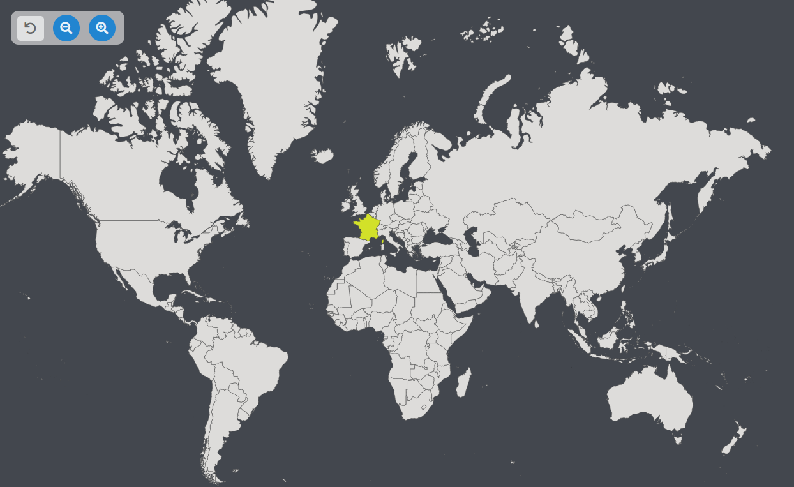

# React-Interactive-WorldMap
>> Currently building

## Preview of the project

This repository has a world map that enables users to click on countries and displays informations about it :

## Technologies

- React (Vite)
- Redux/ ReduxToolKit
- Axios
- Semantic-UI
- SGV Map : [AMCHARTS](https://www.amcharts.com/svg-maps/?map=worldIndia).
- APIs :
  - Global informations : [RESTCountries](https://restcountries.com/).

## Why building this?

I am building this app in order to improve as a React developer and to show my skills.
